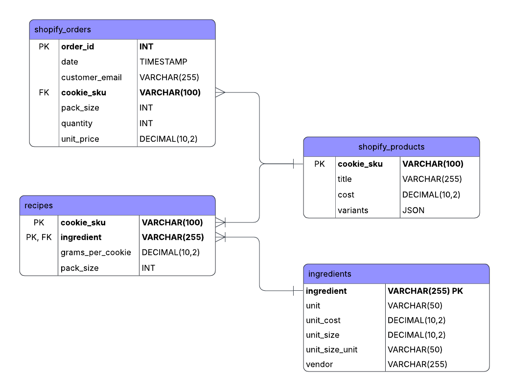

Here is my ER diagram for the main data I'll be organizing for the business:

Business overview goes here

# Generate data
I don't like paying for a ChatGPT subscription, and you can't export CSV files in the free version, so I had it generate pre-formatted dummy data I could easily copy, paste, and plug into a Python script that loaded it all into CSVs that were immediately usable for the project. I know in real life the source data might not be quite this neat and ready to use, but there are still some imperfections that I'll be able to clean up in the transform stage to demonstrate my capability there.

# Write the CSVs
The writecsvs.py file takes all the raw data above and uses pandas to write it all to four separate CSVs and save it to the appropriate location. In a real-world scenario, I'd most likely use the platform's API to automate data refreshes for orders data (with an automated python script to clean the data as necessary). Recipe, ingredient, and product updates might need to be done manually in this kind of small business scenario where those things don't change super regularly.

## Source Data
| CSV |	Grain |	Primary Key	| Notes
|| ingredients.csv | 1 row per ingredient | ingredient | Descriptive info: unit, cost, vendor
|| recipes.csv | 1 row per ingredient per cookie SKU | (cookie_sku, ingredient) | Defines how much of each ingredient goes into each cookie
|| shopify_orders.csv | 1 row per order | order_id | Contains order info; currently one product per order
|| shopify_products.csv | 1 row per cookie SKU | cookie_sku | Product details: title, cost, variants

## Star Schema
### Dimension Tables
| Table | Grain | Key | Notes
|| dim_product | 1 row per SKU | product_id | Maps cookie SKU to descriptive attributes
|| dim_ingredient | 1 row per ingredient | ingredient_id | Stores ingredient details and cost per gram
|| dim_customer | 1 row per customer | customer_id | Stores customer info and first/last order dates
|| dim_date | 1 row per day | date_id | Derived from order dates; supports trend analysis

### Bridge Table
| Table | Grain | Key | Notes
|| recipe_bom | 1 row per ingredient per cookie | (product_id, ingredient_id) | BOM - maps products to ingredients with grams per cookie

### Fact Tables
| Table | Grain | Key | Notes
|| fact_sales | 1 row per order | sales_id | Tracks order-level metrics: quantity, pack size, cookies sold, revenue
|| fact_ingredient_usage | 1 row per ingredient per order | usage_id | Tracks ingredient usage and cost for each order

### Mermaid Diagram of Star Schema

erDiagram
    DIM_PRODUCT ||--o{ RECIPE_BOM : "product_id"
    DIM_INGREDIENT ||--o{ RECIPE_BOM : "ingredient_id"
    RECIPE_BOM ||--o{ FACT_INGREDIENT_USAGE : "product_id, ingredient_id"
    DIM_PRODUCT ||--o{ FACT_SALES : "product_id"
    DIM_CUSTOMER ||--o{ FACT_SALES : "customer_id"
    DIM_DATE ||--o{ FACT_SALES : "date_id"
    FACT_SALES ||--o{ FACT_INGREDIENT_USAGE : "order_id"

    DIM_PRODUCT {
        string product_id
        string cookie_sku
        string title
        float base_cost
        int pack_size
    }

    DIM_INGREDIENT {
        string ingredient_id
        string ingredient
        float cost_per_gram
        string unit
        string vendor
    }

    DIM_CUSTOMER {
        string customer_id
        string customer_email
        date first_order_date
        date last_order_date
    }

    DIM_DATE {
        string date_id
        date date
        int day
        int week
        int month
        int year
        string season
    }

    FACT_SALES {
        string sales_id
        string order_id
        string date_id
        string customer_id
        string product_id
        int quantity
        int pack_size
        int cookies_sold
        float revenue
        float unit_price
    }

    RECIPE_BOM {
        string product_id
        string ingredient_id
        float grams_per_cookie
    }

    FACT_INGREDIENT_USAGE {
        string usage_id
        string order_id
        string product_id
        string ingredient_id
        float grams_used
        float cost
    }

## ETL High-Level Overview
1. Generate Surrogate Keys
product_id, ingredient_id, customer_id, date_id, sales_id, usage_id

2. Derived Metrics
cookies_sold = quantity × pack_size
grams_used = cookies_sold × grams_per_cookie
ingredient_cost = grams_used × cost_per_gram
revenue = quantity × unit_price

3. Joins / Lookups
shopify_orders.cookie_sku → dim_product
shopify_orders.customer_email → dim_customer
shopify_orders.date → dim_date
recipe_bom → dim_product & dim_ingredient for ingredient usage

# Pipeline Script
The /pipeline folder contains another diagram of the schema, as well as the ETL pipeline script. 

The etl_pipeline.py script builds extract functions for each data source, transform functions for each dimension and fact table being built, and one all-purpose "load" function to write and save a CSV.

Lastly, the script defines and then calls a "main" function that puts all the ETL functions together, creating and writing each table to CSV in the warehouse folder. Since this is a small project, I skipped the Staging layer because it wasn't needed for this data's relatively simple calculations.

# Quality Check
The checktables.py script makes sure each of the dimension and fact tables generated is ready to be used. It shows a column name/data type/row count summary for each, and then defines and calls functions to check for duplicates, nulls, positive values, and check all foreign keys. This makes sure the data is ready to be stored and then analyzed.

# Inspect Warehouse Script
This script produces a clean, easy-to-copy list of each table created in the warehouse, including their column names and data types, in preparation for loading them to the SQL database.

# Create tables in MySQLWorkbench database
I've set up a local MySQL database called cookie_database, and in MySQLWorkbench, I created tables within it that correspond to the ones I made in /warehouse.

# Load to MySQLWorkbench Script
This script loads data from all the tables in /warehouse, into the tables I created in the cookie_database.

*** These last few steps need work - some features are not matching up from /warehouse to the tables in MSW.